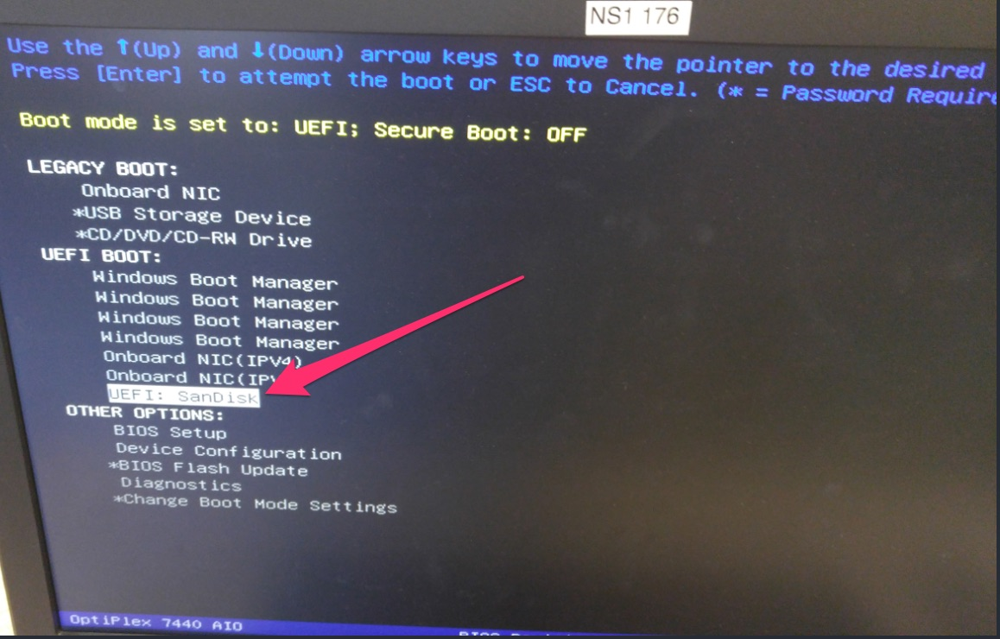

# Persistent Linux distributions on thumb drives

## Background

Credit for this idea basically goes to Maximiliano Troncoso, David Saezsan, and Esteban Vohringer-Martinez, with whom I ran a workshop in Chile in 2017 for which we needed very similar software to this course working on a classroom full of Windows machines.
They discovered it was possible to create bootable persistent Linux distributions on thumb drives and install all of the prerequisites on these thumb drives; we were able to use this approach very successfully for the workshop and will adapt it for this course as needed.

Their instructions for setup of the process are available on the [workshop repository](https://github.com/QCMM/workshop2017/blob/master/Persistent_Live_USB_Sticks.pdf).

I have been able to create persistent drives using a very similar approach from a Linux machine (in my case, a dual boot with Windows; I haven't been able to do this using the Windows side as most tools I've found seem to not allow persistent space past 4 GB and the software we will install is closer to 5 GB).
I basically follow the workshop instructions linked above, select none of the three optional checkboxes in the final step for `mkusb`, and then have to configure my computer to disable secure boot (an option in the startup configuration I can get to by hitting F2 on startup).

## Configuring for the course

When setting up persistent USB sticks for people, I will configure with a `miniconda` installation for you, as in [getting-started.md](../getting-started.md).
However, I will NOT install all of the course prerequisites; it is important that you **complete the installation on the computer you intend to run on** as some of the tools are compiled software which is architecture-dependent and will not run properly unless it is installed on the computer you want to use.

To use a persistent live USB stick and boot to Linux, insert it into the computer you wish to use, restart the computer, and boot from the USB stick.
To boot from the USB stick, hold down F12 (typically) as you restart, then (on most laptops) select the UEFI BOOT option to boot from the USB in question (in my case "UEFI: SanDisk"), as shown here. 
Select the "Persistent live" option when prompted, then wait for it to boot.
I often see an error or warning message or two while it is booting (at least on the computers in the classroom) but it usually works without problems anyway, even if it takes a minute or two.
You should then be running a full distribution of Ubuntu Linux (though with relatively minimal storage, since the USB stick is carrying the operating system, plus any files and sofware you install).

Once you are up and running, install git (`sudo apt-get install git`) and then proceed with the instructions in the "getting started" documentation, **except for 2018 see [Troubleshooting](#troubleshooting), below**.


## Troubleshooting

On my computer running Ubuntu 16.04 LTS from late 2017, I currently run into an issue with `mdtraj` with GLIBC from `libstdc++.so.6` as described [in this anaconda thread](https://github.com/continuumio/anaconda-issues/issues/483); I have resolved this by NOT installing `gcc` as per the getting started info and instead [per this comment](https://github.com/continuumio/anaconda-issues/issues/483#issuecomment-339885983) installing `gcc_49` via:
```
conda uninstall gcc
conda install -c serge-sans-paille gcc_49
```
then I continue installing via the course instructions, installing everything BUT gcc.
However, this seems a bit odd to me and I expect this work around not be a good long-term solution; in fact in the long term it seems likely the issue would get resolved by fixes elsewhere.
